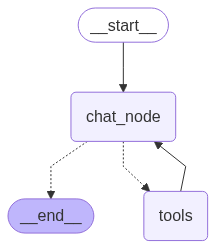

# AI_agents

## Project Overview

This repository is a hands-on exploration of agentic AI systems, with a focus on building and understanding agents from the ground up. The goal is to:

- Understand what an agent is and how it operates
- Build a ReAct-style agent from scratch, progressing toward framework-based implementations
- Learn how LangGraph and LangChain model agent workflows
- Run all components locally using Ollama to preserve privacy
- Experiment with streaming responses, memory, and conditional routing

  

### `agent_one.py`

A fully manual ReAct-style agent built without any frameworks. This script demonstrates the core logic behind agentic reasoning and decision-making, offering a transparent view into how agents can be constructed from first principles.

#### Blog Post

For a detailed walkthrough of this agent and its design philosophy, see the accompanying blog post:  
[How an AI Agent Works Without a Framework](https://humansideoftek.blogspot.com/2025/09/how-ai-agent-works-without-framework.html)

---

### `agents/`

This directory contains prototypes of various agent architectures and interaction styles:

| File              | Description                                                                 |
|-------------------|-----------------------------------------------------------------------------|
| `RagAgent.py`     | A Retrieval-Augmented Generation (RAG) agent using Chroma for local vector storage and document retrieval |
| `chatbot_1.py`    | A minimal chatbot designed for baseline testing and simple conversational flow |
| `chatbot_2.py`    | A chatbot enhanced with `checkpointer-memory` and `MessageState` for persistent context and improved dialogue management |
| `conversation.py` | A multi-agent simulation where two bots engage in a structured conversation over a set number of turns. The topic is based on what my 9th grader is currently learning in school, showcasing how agents can be used for educational dialogue and reinforcement |
